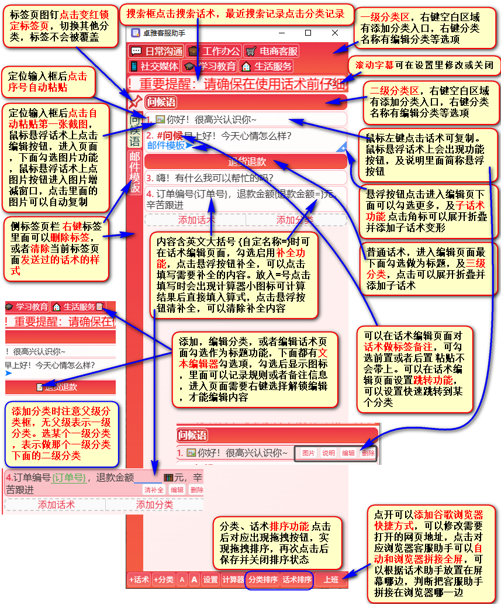

# 卓雅客服助手

本地轻量的桌面话术管理工具，专为线上文字客服高频回复场景打造，数据仅本地保存，隐私可控。

## 命名由来

取名「卓雅客服助手」，是感谢一位朋友，开发期间给了我很多实用思路灵感，以此聊表谢意。

## 开发初衷

快速答复客户疑问，减轻客服工作压力、减少回复差错。耗时大半年独立开发个人首款工具，全程依靠各类 AI 调试，核心功能已打磨完善。

## 核心特性

### 📝 话术管理

- 富文本编辑（字体颜色、背景色、加粗），标题卡片分组与折叠
- 软删除（回收站可恢复）、手动拖拽排序、自动记录使用次数
- 占位符补全（`{变量}` 一键替换）、图片附件、使用说明、多版本变形话术、分类跳转

### 🏷️ 分类与标签

- 多级分类（一级平铺 + 二级标签页），分类代名词快速切换
- 客户标签双向同步，支持固定置顶、按标签独立统计

### ⚡ 高效交互

- 点击卡片自动复制（防误触：选中文本/拖拽不触发）
- 序号点击「复制+自动粘贴」不抢焦点，不打断当前操作
- 实时全文/标签/分类组合搜索，结果高亮

### 🎨 个性化

- 12 种主题颜色、界面字体大小可调
- 内置计算器、富文本编辑器、浏览器快捷方式

### 🛡️ 数据安全

- 纯本地 IndexedDB 存储，无服务器上传
- 回收站保护，支持数据目录手动备份

## 使用说明

下载压缩包解压运行，初次打开数据库空白，可自行新建分类话术。若需固定某个二级分类页面不被覆盖，使用图钉置顶锁定即可。

## 界面预览

顶部为分类标签栏，可快速切换不同场景的话术库；左侧为当前分类的标签页，主区域展示话术列表，每条话术支持编辑、复制、图片附件等操作；底部工具栏提供添加话术/分类、排序、计算器等快捷功能。

## 补充说明

免费分享同行，不作商用。此版本就当作这段折腾的收尾，细小问题就不再调整。自身身体扛不住客服高强度工作，之后打算换别的方向学习摸索。若有软件开发从业者觉得工具的设计思路有参考价值，欢迎交流探讨，也乐意分享实操层面的使用想法。